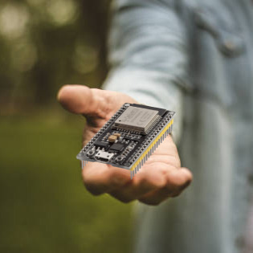

#   Presentation Projet

Ce projet etant un projet de **terminale STI2D** contiendra des elements et des pieces electroniques.  
Ici, une <a href="https://fr.wikipedia.org/wiki/ESP32">ESP32</a> sera utilisée pour ses intégrations wifi et bluetooth.

 

# Composants