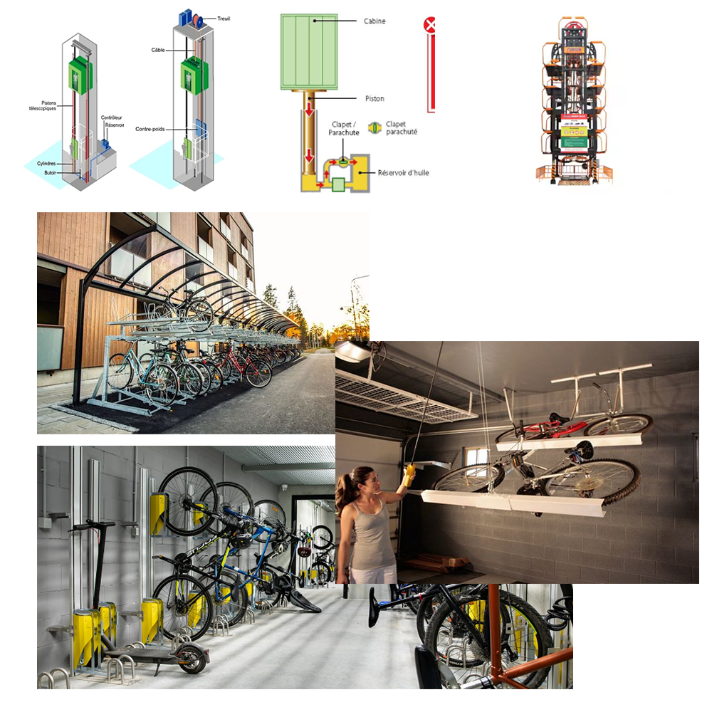

de: GABIN  
FOR ENGLISH VER GO [HERE](ITEC_REVIEW1_EN.md)

<b><u>
Revue 1 projet BAC 
Ascenseur a velo:</u></b>

<b>PROBLEMATIQUE:</b> Comment sécuriser et stationner facilement les vélos en ville ? 

Le groupe est composé de trois ITEC et de deux SIN.

 
Pour la <b><u>répartition des tâches :</u></b>  

-Joé s’occupe de sécuriser les vélos et de faire la conception des loquets.  
-Jules s’occupe du déplacement de la structure.  
-Gabin s’occupe du stationnement des vélos et faire la conception des raques à vélo avec système de rampe.   
Puis une fois nos tâches finis nous feront ensemble le système de poulie.

<b><u>Cahier des charges :</u></b> 
<b>Capacité de stationnement élevé: </b> 

Ascenseur a deux étages contenants raques à vélo superposé = 40 vélos / ascenseur.

<b>Gain d’espace au sol:</b>  

Structure avec déplacement vertical.

<b>Facilité d’utilisation:</b>  

Assistance par borne.

<b>Temps d’utilisation rapide:</b>  

Pas de long couloir pour trouver une place.

<b><u>Analyse de l’existant :</u></b> 

